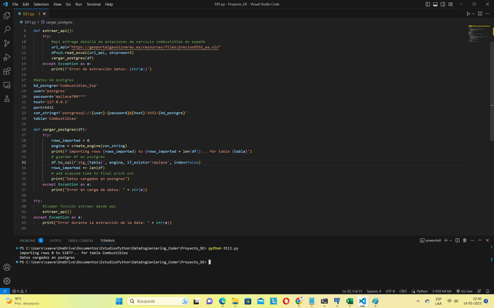
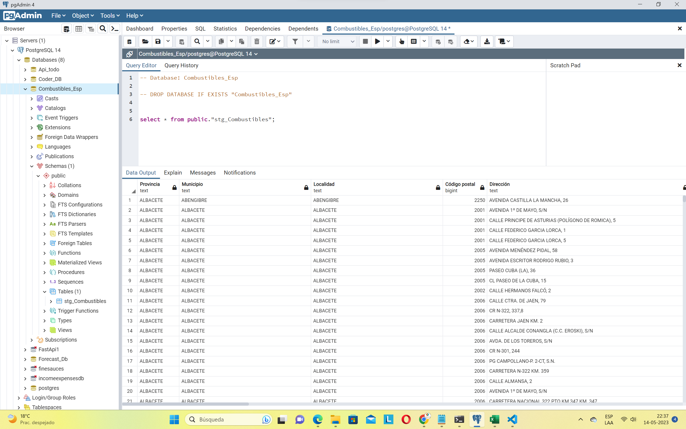
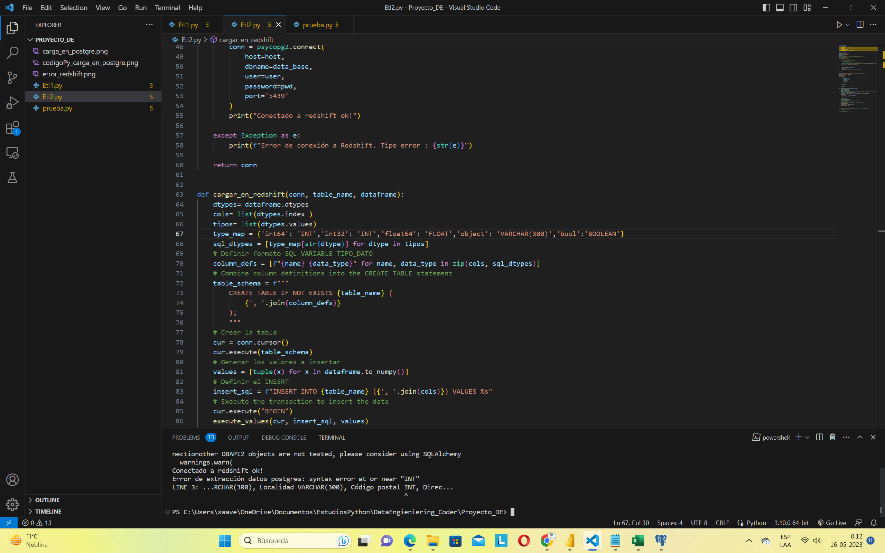

# Coder_DE

## Objetivo

ETL que extrae datos desde API, los carga primero en una bd de datos local Postgresql para posteriormente cargar en Redshift.

## Etapas

* Extracción data desde API. Se convierte data a dataframe con pandas y luego se pasa a SQL.

* Carga de la data en bd local Postgresql

* Cargar copia de la data desde bd local postresql a Redshift. (En desarrollo, falta hacer corrección)

