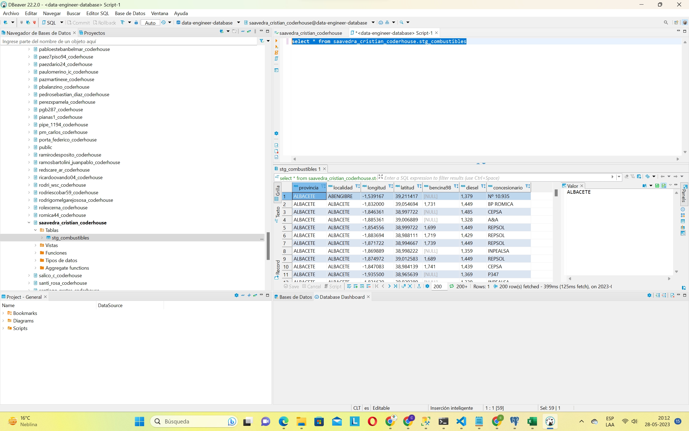

# Coder_DE

## Objetivo

ETL que extrae datos desde API pública en la web, luego los carga, primero en una bd de datos local Postgresql para posteriormente cargar en Redshift.

### Primera Parte

* Extracción de data desde API web.
* Carga de data extraída en bd local postgres

### Segunda Parte

* Transformación tabla, selección de columnas. Luego carga de la tabla transformada en redshift
* Transformación tabla para generar una segunda tabla, reemplazo de comas por puntos en columnas de precios, uso de CAST para convertir object a float, agregación COUNT y Average, agrupación group by. Carga de esta segunda tabla transformada en redshift.

### Tercera Parte

* Uso de Docker y Airflow

#### Cuarta Parte

* Envío aviso notificación por email proceso ETL ok

## Etapas e imágenes

* Extracción data desde API web. Se convierte data a dataframe con pandas y luego se pasa a SQL postres local. El código está en archivo Etl1.py

* Carga de la data en bd local Postgresql

* Cargar data desde bd local postresql a Redshift, tabla transformada seleccionando sólo columnas de interés. El código está en archivo Etl2.py

* Primera tabla cargada en redshift. El código está en archivo Etl2.py

* Segunda tabla cargada en redshift, complementando también se incluye imágen de la segunda tabla en consola postgres. El código está en archivo Etl2.py

* Uso de Docker y Airflow

Primer intento (arrojó el error el primer intento ---- debo corregir )

Segundo intento corrección del fail

Imagenes tareas y log de Airflow

* Envio Notificación Email

  
